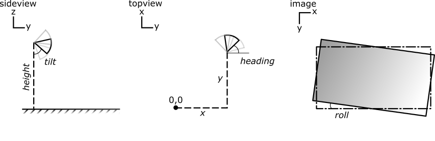

General
=======

Intrinsic parameters
--------------------

First of all to use the `CameraTransform` package, you need to find the intrinsic parameters of your camera:

- the focal length ``f`` of the camera in mm
- the ``sensor size`` of the camera in mm
- and the ``image size`` of the camera in pixels

If you have a jpeg image with exif information, you can try to get these parameters by the function
:py:func:`CameraTransform.getCameraParametersFromExif`. If this data is not present in the exif information, you have to
specify the parameters by hand.

The focal length can be found in the exif data of jpeg images. It is not fixed for most cameras, because it depends on
the zoom factor of the objective.

The sensor size is defined by the chip the camera uses and can be found e.g. on the wikipedia page of most cameras.

The image size can also be found in the properties of an image or by loading it in python and inspecting the dimensions:

.. code-block:: python
    :linenos:

    from scipy.misc import imread

    im = imread("image.jpg")
    print("Width:", im.shape[1], "Height:", im.shape[0])

.. warning::
    Note that images in numpy arrays are stored with y and x coordinates. Therefore im.shape will give you [height, width],
    e.g. first y dimension and then x dimension.

Knowing the intrinsic parameters allows to create an instance of the `CameraTransform` class:

.. code-block:: python
    :linenos:

    import CameraTransform as ct

    f = 14
    sensor_width = 17.3
    im_width = 4608
    im_height = 2592

    cam = ct.CameraTransform(f, sensor_width, (im_width, im_height))

Then there are multiple ways to fit the extrinsic camera parameters, such as height and tilt, to find out how the camera
is positioned in the world.

Extrinsic parameters
--------------------

The extrinsic parameters define the position of the camera in the world. They consist of three coordinates and three angles:

- `x`
- `y`
- `height` (`z`)
- `tilt`
  (0°: camera faces down, 90°: camera faces parallel to the ground, 180°: camera faces upwards)
- `roll`
  (0°: camera image is not rotated (landscape format), 90°: camera image is in portrait format, 180°: camera is in upside down landscape format)
- `heading`
  (0°: the camera faces "north", 90°: east, 180°: south, 270°: west)

For the most simple case, the camera can be assumed to be at the origin of the coordinate system (`x`=0, `y`=0) placed at a
given `height` and heading north (`heading`=0). The xy-position and the heading are only important if the positions have
to be combined with other cameras or maps.

Therefore in the simple case the extrinsic parameters can be set to only three parameters `height`, `tilt` and `roll`.
When the camera is assumed to be in an upright pos, `roll` can also be fixed to 0.

    `Height` and `tilt` can be seen in the side view. Offset (`x`, `y`) and `heading` can be seen in the top view and
    the roll can be seen in the image view.